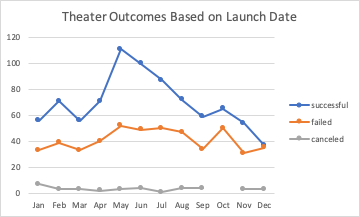
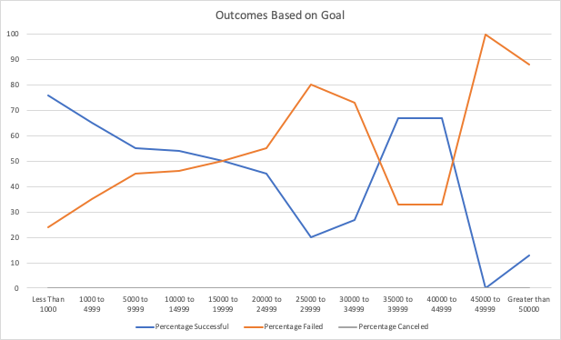

# kickstarter-analysis
## Overview of Project
Performing analysis on Kickstarter data to uncover trends
### Purpose
The included content is an analysis of a dataset representing various Kickstarter campaigns. Several variables are specifically analyzed including goal amount, launch date, outcome, pledge amounts, and category of campaign. This ultimately will provide some insight to support launching a campaign more likely to be successful. 
## Analysis and Challenges
### Analysis of Outcomes Based on Launch Date
To explore the factor of timing as it may impact campaign success, the following chart specifically filters campaigns for plays based on the time of year they were launched. The lines indicate how many were ultimately successful *(blue)* or failed *(orange)*. This indicates the highest number of successful campaigns were launched in **May**, while December has the least number of successful campaigns launched.

### Analysis of Outcomes Based on Goals
Another variable analyzed was campaign goal. For all campaigns for plays in this dataset, the below chart illustrates how success rates vary based on campaign goal. This indicates campaigns with higher goals have a higher failure rate *(orange)*. Campaigns with a goal of **under $1,000** are most successful *(blue)*. Success rate of campaigns has a negative correlation to campaign goal up to a goal of $25,000. Campaigns are least successful when the goal is over $45,000.

### Challenges and Difficulties Encountered
One potential challenge with this dataset is the amount of filters that could be applied (subcategory, country, goal, etc.) to a point that the targeted filtered subset could be too limiting. For example, some Kickstarter campaigns for certain subcategories and/or countries are a sample set of less than 5. Fortunately for this specific analysis, the subset of campaigns for plays in the United States was still robust and also demonstrated similar success factors compared to the full dataset. 
## Results
- The highest number of successful campaigns for plays in the United States were launched in **May** (111). 
- The lowest number of successful campaigns for plays in the United States were launched in **December** (37). 
- Campaigns **less than $15,000** are more than 50% successful.
- One of the limitations of this dataset is it contains campaigns strictly through Kickstarter, missing any other sources of crowdfunding.
- Another limitation in the category/subcategory of this data is the combined types of plays (original versus classic) which may impact success rate. 
- A third limitation involves location - the data categorizes campaigns by country only. Within the United States, the city/state of the proposed play may also influence the success rate of the crowdsourcing campaign. 
- A final limitation of the dataset is any information about the campaigner, in particular if the fundraiser is a first-time Kickstarter campaign host or if they have crowdfunding campaign history/following, which may also influence the success rate of the campaign.
Some additional tables/graphs that could be helpful:
- Graphing average pledge amount with number of campaign supporters to determine how those factors influence campaign success.
- Table/graph with average length of campaign compared to success rate. 
- Modify launch date graph to illustrate percentage of successful/failed campaigns by month - graph above indicates total number per month. The month of May also had the highest total number of campaigns while December had the lowest total number of campaigns, so the number of successful/failed campaigns follows a similar trend to the total number. 
